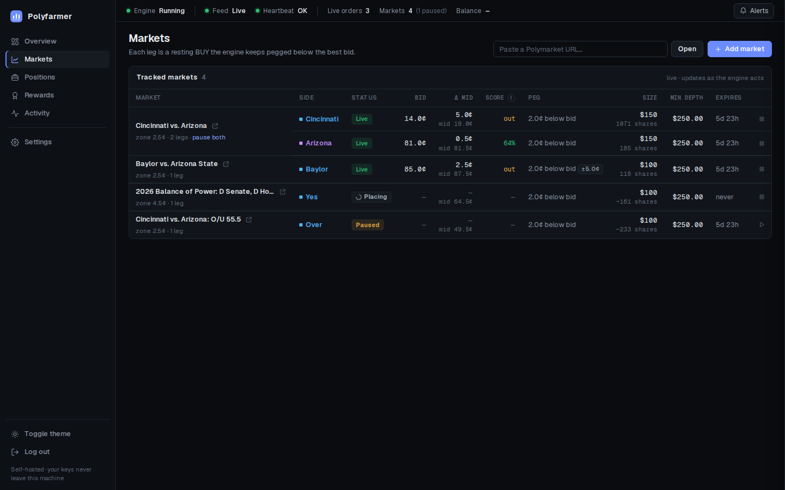
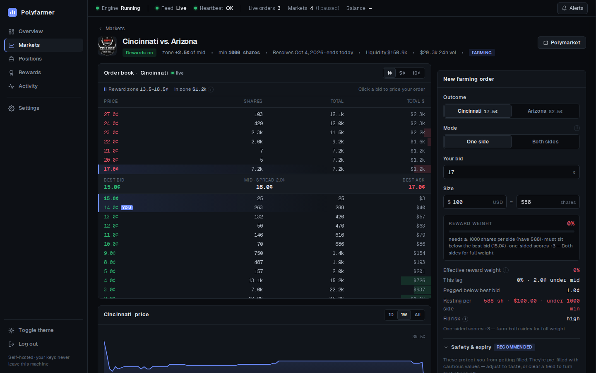
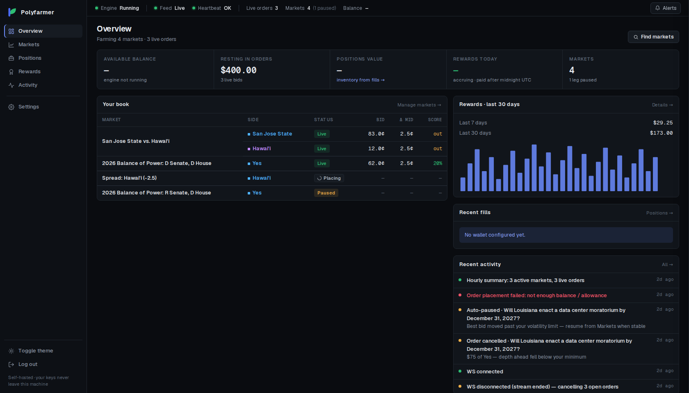
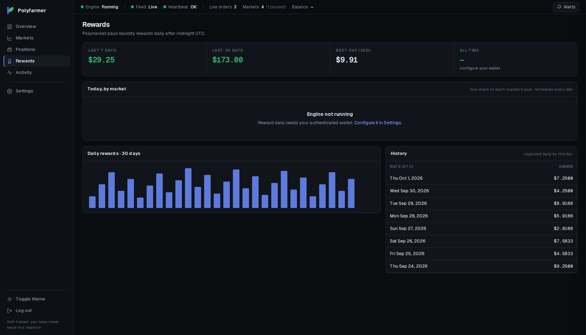

<div align="center">


# Polyfarmer

**Farm liquidity rewards on Polymarket from your own machine. Your keys never leave it.**

[](https://github.com/Vayz0001/polyfarmer/actions/workflows/ci.yml)
[](LICENSE)
[](https://www.rust-lang.org)
[](#install)
[](#project-status)

[Install](#install) · [First run](#first-run) · [Remote access](#reaching-the-dashboard-remotely) · [Security](#security) · [FAQ](#faq-and-troubleshooting) · [Contributing](CONTRIBUTING.md)



</div>

> [!WARNING]
> **Polyfarmer trades real money.** There are no guarantees: resting orders can fill, markets can move,
> and software has bugs. Use a dedicated wallet holding only what you can afford to lose, start with one
> small market, and watch it. Nothing here is financial advice, and Polymarket may not be available where
> you live.

## What it does

Polymarket pays market makers every day for resting limit orders near a market's midpoint. Polyfarmer
keeps a resting **BUY** a distance you choose below the best bid on the markets you pick, follows the
order book as it moves, and pulls the order whenever the protection you configured isn't there. You
manage everything from a local web dashboard.

- **Self-hosted.** One program on your computer or server. Your private key is encrypted on your disk and
  never sent anywhere except to sign orders for Polymarket.
- **Safety first.** Every order is protected by settings you control, and everything is cancelled when
  something looks wrong.
- **See what you earn.** Live order book, reward score for each order, positions, daily and all-time rewards.

### Protection for every order

| Setting | What it does |
| --- | --- |
| **Distance** | How far below the best bid your order rests. It is re-pegged as the bid moves. |
| **Minimum depth** (USD) | The order is cancelled if less than this sits between it and the best bid, so others get filled first. |
| **Auto-pause** | Stops quoting if the best bid moves further than your volatility limit. |
| **Expiry** | After this time the order is cancelled and not placed again. |
| **Shutdown, disconnect, heartbeat failure** | All resting orders are cancelled. |

## The dashboard

<table>
  <tr>
    <td width="50%"><br><sub><b>Market view</b>: live order book with cumulative USD depth, your orders marked, and a reward-weight meter that follows Polymarket's scoring rules.</sub></td>
    <td width="50%"><br><sub><b>Overview</b>: balance, money in orders, your book, recent fills, activity and rewards for the last 30 days.</sub></td>
  </tr>
  <tr>
    <td width="50%"><br><sub><b>Markets</b>: every leg with its status, distance from the midpoint, reward score, size and expiry. Pause, resume, edit in place or remove.</sub></td>
    <td width="50%"><br><sub><b>Rewards</b>: today's accrual, a 30-day history and the all-time total.</sub></td>
  </tr>
</table>

The screenshots come from the built-in demo mode, which uses real reward markets and fake orders.

## Install

Polyfarmer is built from source with the Rust toolchain; it is a single self-contained program.
Pick your system:

<details open>
<summary><b>Linux</b></summary>

1. Install the build tools and Git.

   ```bash
   # Debian / Ubuntu
   sudo apt install build-essential pkg-config libssl-dev git curl
   # Fedora
   sudo dnf install gcc pkgconf-pkg-config openssl-devel git curl
   # Arch
   sudo pacman -S base-devel openssl pkgconf git curl
   ```

2. Install Rust with [rustup](https://rustup.rs), then restart your terminal.

   ```bash
   curl --proto '=https' --tlsv1.2 -sSf https://sh.rustup.rs | sh
   ```

3. Download and run Polyfarmer.

   ```bash
   git clone https://github.com/Vayz0001/polyfarmer.git
   cd polyfarmer
   cargo run --release
   ```

</details>

<details>
<summary><b>macOS</b></summary>

1. Open **Terminal** (press `⌘ Space`, type "Terminal") and check whether Rust is already installed:

   ```bash
   rustc --version
   ```

   If it prints a version (for example because you installed Rust with Homebrew), **skip to step 3**.
   If it says `command not found`, do step 2.

2. Install Apple's developer tools and Rust. If a pop-up window opens for the developer tools, let it
   finish. Then close Terminal and open it again.

   ```bash
   xcode-select --install
   curl --proto '=https' --tlsv1.2 -sSf https://sh.rustup.rs | sh -s -- -y
   ```

3. Download and run Polyfarmer. The first build takes a few minutes. When it finishes, Terminal prints a
   setup link, and you continue with [First run](#first-run).

   ```bash
   git clone https://github.com/Vayz0001/polyfarmer.git
   cd polyfarmer
   cargo run --release
   ```

</details>

<details>
<summary><b>Windows 10 and 11</b></summary>

1. Open **PowerShell** (Start menu, type "PowerShell") and install Git, Rust and the C++ build tools with
   Windows' built-in package manager, `winget`. The build tools are a large download. When it finishes, close
   PowerShell and open it again.

   ```powershell
   winget install --id Git.Git -e
   winget install --id Rustlang.Rustup -e
   winget install --id Microsoft.VisualStudio.2022.BuildTools -e --override "--passive --wait --add Microsoft.VisualStudio.Component.VC.Tools.x86.x64 --add Microsoft.VisualStudio.Component.Windows11SDK.22621"
   ```

2. Download and run Polyfarmer. The first build takes a few minutes. When it finishes, PowerShell prints a
   setup link, and you continue with [First run](#first-run).

   ```powershell
   git clone https://github.com/Vayz0001/polyfarmer.git
   cd polyfarmer
   cargo run --release
   ```

**Windows notes**

- Stop Polyfarmer with **Ctrl+C** in its window. That cancels your resting orders before it exits. If you
  close the window or kill the process instead, orders stay on Polymarket until you start Polyfarmer again
  (it cancels leftovers on your tracked markets at startup) or cancel them on polymarket.com.
- Files are stored in the `data` folder next to where you started it. Windows does not get the owner-only
  file permissions that Linux and macOS do, so keep the folder inside your own user profile and don't
  share it.
- WSL 2 works too: follow the Linux steps inside your Ubuntu shell.

</details>

The first build takes a few minutes. Later starts are instant. To update, run `git pull` and start it again.

## First run

1. The first start prints a **setup code** and a link in the terminal:

   ```text
   First run — create your admin password:
     setup code:  abcd-efgh
     open:        http://127.0.0.1:8080/welcome?code=abcd-efgh
   ```

   Open the link in your browser (or open `http://127.0.0.1:8080` and type the code) and choose a password
   of 12 to 128 characters.
2. Go to **Settings → Wallet** and paste your private key. It is encrypted on disk, and your Polymarket
   wallet address is detected from the chain.
3. Go to **Markets → Find markets**, pick a market that pays rewards, and start with a **small size**.

Your state lives in the `data` folder: the encrypted wallet, your password hash and your market settings.
Back it up like a wallet. It is excluded from Git.

### Try it without a wallet

```bash
DEMO=1 cargo run --example serve        # Linux and macOS
```

```powershell
$env:DEMO = "1"; cargo run --example serve    # Windows PowerShell
```

Open the printed link and log in with the password `demo-password`. You get real reward markets and live
order books with fake orders, and nothing is traded.

## Reaching the dashboard remotely

The dashboard listens on `127.0.0.1`, which means only the machine it runs on can open it. That is on
purpose. **Never put it on the public internet.** To use it from a laptop or phone when it runs on a
server, pick one of these.

### Tailscale (recommended)

A private network between your own devices: no open ports, real HTTPS, and it is free for personal use.

```bash
# on the server
curl -fsSL https://tailscale.com/install.sh | sh
sudo tailscale up
sudo tailscale serve --bg 8080          # gives you https://<server>.<tailnet>.ts.net
tailscale serve status                  # check it; `sudo tailscale serve reset` turns it off
```

Install Tailscale on your phone or laptop, sign in to the same tailnet, and open that address. Because it
is HTTPS, set `DASHBOARD_SECURE_COOKIES=true` (see [Configuration](#configuration)). Tailscale may ask you
to enable HTTPS certificates for your tailnet the first time. On macOS and Windows, install the Tailscale app
and run `tailscale serve --bg 8080` in a terminal.

> [!CAUTION]
> Do not use `tailscale funnel` for this. Funnel publishes the service to the whole internet.

### SSH tunnel

```bash
ssh -L 8080:127.0.0.1:8080 you@your-server       # then open http://127.0.0.1:8080
```

No setup needed, and fine for occasional use. Windows 10 and 11 include the same `ssh` command.

### Other

An HTTPS reverse proxy such as Caddy or nginx in front of `127.0.0.1:8080` also works. Do not bind
`DASHBOARD_BIND` to `0.0.0.0` on a public address without one, and set `DASHBOARD_SECURE_COOKIES=true`.

**First-run safety:** until the admin password exists, the setup page needs the one-time code from the
log, so a stranger who finds the address first can't claim your install. On a server, read it with
`journalctl -u polyfarmer` or `cat data/setup.code`.

## Running as a service

On Linux, [`deploy/polyfarmer.service`](deploy/polyfarmer.service) is a hardened systemd unit, with install
steps in its header. `systemctl stop` sends SIGTERM and Polyfarmer cancels its resting orders before it exits.

There is no packaged service for macOS or Windows yet. Run it in a terminal (or `tmux`), or use your own
service manager, and make sure it stops Polyfarmer with Ctrl+C or SIGTERM so the orders get cancelled.

## Configuration

Everything is optional and has a default. [`.env.example`](.env.example) lists every setting with its
default and what it does; copy it to `.env` and uncomment what you want to change. The ones you are most
likely to need:

| Setting | Why you might change it |
| --- | --- |
| `DASHBOARD_BIND` | Use a different port, or listen on a tailnet address. |
| `DASHBOARD_SECURE_COOKIES` | Set to `true` when the dashboard is served over HTTPS. |
| `POLYGON_RPC_URL` | Use your own reliable RPC for the balance and wallet detection. |

Your private key is **not** configured here; it is entered in Settings.

## Security

The short version, since this program holds a wallet key:

- The wallet key is encrypted with ChaCha20-Poly1305. The encryption key (`data/master.key`) sits **next
  to** the encrypted wallet so the bot can restart unattended. That means anyone who can read your whole
  `data` folder can decrypt the wallet. Protect the machine and its backups, and use a dedicated wallet.
- Passwords are stored as argon2 hashes. Failed logins are throttled per source with growing lockouts,
  and sessions expire after 12 hours idle or 7 days in total.
- Every form post carries a CSRF token, pages are served with a strict Content-Security-Policy, and every
  value you enter is range-checked.
- Secrets are written owner-only and atomically on Linux and macOS, the process disables core dumps on
  Linux, and the systemd unit drops everything it does not need.
- Polyfarmer talks only to Polymarket, a Polygon RPC, and the browser you connect.

Details, the limits of what is covered, and how to report a vulnerability privately are in
[SECURITY.md](SECURITY.md).

## FAQ and troubleshooting

<details>
<summary><b>The balance shows "—".</b></summary>

The balance is read from your Polymarket wallet once a wallet is configured and the engine is running. In
demo mode there is no wallet, so it stays empty. If it stays empty with a wallet, set your own
`POLYGON_RPC_URL`: the public endpoints are sometimes rate-limited.
</details>

<details>
<summary><b>I lost the setup code or the password.</b></summary>

Before a password exists, the setup code is printed at startup and saved in `data/setup.code`. If you
forgot the password afterwards, stop Polyfarmer, delete `data/admin.json`, and start it again to set a new
one. Your encrypted wallet and markets are kept.
</details>

<details>
<summary><b>"Address already in use".</b></summary>

Something else is using port 8080. Set `DASHBOARD_BIND=127.0.0.1:8090` (or any free port) in `.env`.
</details>

<details>
<summary><b>The build fails on Windows with "link.exe not found" or a NASM error.</b></summary>

Run the third `winget` command from step 1 of the Windows instructions again, to install the C++ build tools,
then open a new PowerShell window. A NASM error should not happen, because the project is set up to build without
it. If you see one, please open an issue with the full error text.
</details>

<details>
<summary><b>The build fails on Linux with "could not find OpenSSL".</b></summary>

Install the development packages from step 1 of the Linux instructions (`pkg-config` and `libssl-dev` on
Debian and Ubuntu).
</details>

<details>
<summary><b>An order filled. What now?</b></summary>

When a resting bid fills, you own that position. Polyfarmer does not sell or hedge it for you; you see it
under **Positions** and manage it on Polymarket.
</details>

## Project status

Polyfarmer is in **beta**: it works and is tested, but expect rough edges, and settings or screens may change
between releases (see the [changelog](CHANGELOG.md)). Known limits today:

- One wallet at a time. Switching accounts doesn't cancel the old account's orders, so pause or remove your
  markets first.
- Orders follow the best bid, not the midpoint, and a one-sided order earns nothing when the midpoint is
  outside 10 to 90 cents. The dashboard shows your reward weight before you start.
- It runs from source. Prebuilt downloads and Docker images are not available yet.

## Contributing

Bug reports, ideas and pull requests are welcome. Please read [CONTRIBUTING.md](CONTRIBUTING.md) first; it
covers setup on Linux, macOS and Windows, the checks every change must pass, and how to propose changes to
trading behaviour. Found a security problem? Please follow [SECURITY.md](SECURITY.md) instead of opening a
public issue.

## License and credits

Released under the [MIT license](LICENSE). The dashboard uses [htmx](https://htmx.org) and the
[Geist](https://github.com/vercel/geist-font) fonts; see [THIRD_PARTY_NOTICES.md](THIRD_PARTY_NOTICES.md).
Trading goes through the official [Polymarket Rust SDK](https://github.com/Polymarket/rs-clob-client-v2).
Polyfarmer is an independent project and is not affiliated with or endorsed by Polymarket.
